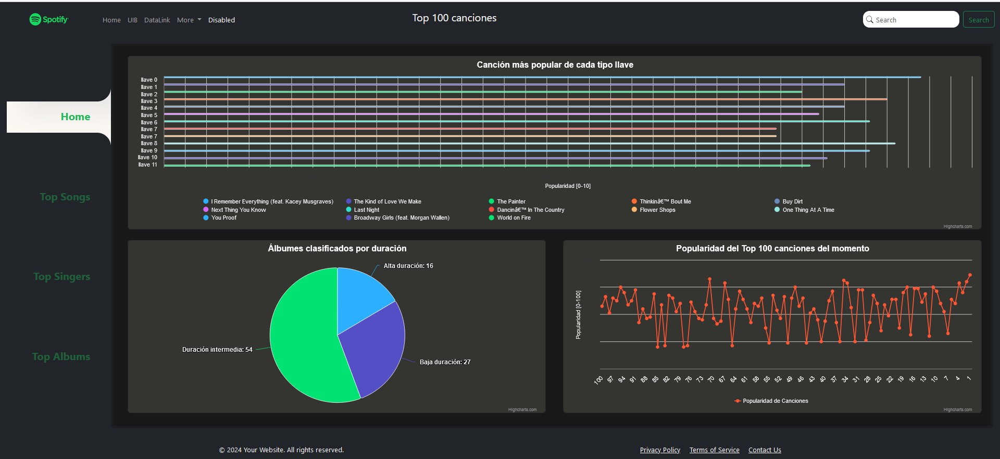
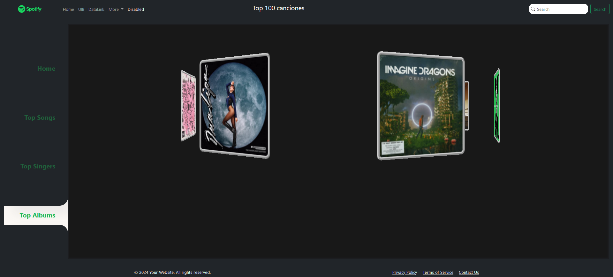

# Top 100 canciones de Spotify

En este proyecto se ha estudiado y graficado el top 100 canciones de Spotify. Dichos datos se han extraído de un dataset importado de Kaggle.

Para poder realizarlo hemos utilizado varias herramientas:  
    - Para la creacion de la base de datos y la obtención de estos hemos usado php, xampp y MySql.  
    - Para la creación de las gráficas y los componentes dinámicos de la pagina web hemos usado JavaScript.  
    - Para la estructura interna de la página hemos usado html.  
    - Para la edición estética de los elementos css.  

Para ejecutar el proyecto, al ser un archivo php, se ha de guardar el proyecto en el directorio de xampp/htdocs/, tener configurado y activo el panel de control de xamp y abrirlo en el navegador con un url compuesto por "localhost/" + más el nombre del directorio restante hasta llegar al archivo "index.php". En nuestro caso sería "localhost/Practica1ADIU/index.php".

Además de hacer las gráficas en la pantalla principal también se han implementado 3 pantallas extra y una barra lateral para poder navegar por la página. La barra ha sido implementada a modo de necesidad para poder acceder a las pantallas extra. En estas tres funcionalidades adicionales se muestra por pantalla el top 5 de artistas, el top 5 albumes y el top 5 canciones de los datos que hemos usado. Con el objetivo de explorar diferentes funcionalidades de css y html hemos hecho que las imagenes de cada top se mantegan en movimiento sin que eso reduzca su accesibilidad.

    - Top 5 canciones:

    - Top 5 artistas:

    - Top 5 álbumes:

Este proyecto ha sido realizado por Aarón Fernández Ramón 45186605t y Mateu Torrens Morey 41618559j.
